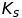
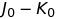
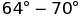
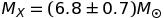

# Infrared Observations of GRO J1655–40: Constraints on the Black Hole Mass

MSc dissertation, Francis T. O'Donovan, October 2003.

_Source:_ <http://library.ucc.ie/record=b1373041>

_Mirrors:_

- https://github.com/proinsias/infrared-observations/blob/master/pdf/mastersThesis.pdf

_Contact:_ Check out my [webpage](https://proinsias.github.io/about/) for contact details.

Please cite using the following BibTex entry:

```
@mastersthesis{odonovan2003infraredobs,
  title={Infrared Observations of GRO J1655–40: Constraints on the Black Hole Mass},
  author={{O'Donovan}, F.~T.},
  school={National University of Ireland, Cork},
  year=2003,
  month=10,
}
```

[](https://github.com/proinsias/infrared-observations/actions/workflows/cronjobs.yml)
[](https://github.com/proinsias/infrared-observations/actions/workflows/pull-requests-and-pushes.yml)
[](https://github.com/pre-commit/pre-commit)

---

We present – and J–band photometry
of GRO J1655–40 during two epochs of observation, and determine the
dereddened and absolute magnitudes of this star system. We derive a
range of spectral types (F0–G2 III–IV) for the secondary star in GRO
J1655–40, using our  colour estimate
for this soft X–ray transient. We find the absolute magnitude of GRO
J1655–40 to be similar to that of another long period soft X–ray
transient.

The first high signal–to–noise K–band spectrum of a black hole X–ray
transient system (GRO J1655–40) is presented. This is used to show
that the quiescent contribution of the accretion disk in GRO J1655–40
to the total flux of the system in the _K_–band is negligible. We are
therefore able to measure with certainty the binary inclination from
the light curve of this stellar system, and place real bounds on the
mass of the primary star in GRO J1655–40. GRO J1655–40 is also shown
to have a similar spectrum to that of an F5–F7 III–IV star.

The ellipsoidal modulation observed in the –band
is modelled using ELC, to obtain an inclination of
 and a mass ratio of 2.5–6
for the system. These values concur with past results. The derived
primary mass, , suggests that the
compact object in GRO J1655–40 is a black hole.

An attempt is made to model the system in outburst, taking the
ellipsoidal variability of the secondary star and the eclipse of a
bright accretion disk into account. The resultant fit is poor, a
consequence of the asymmetries of the disk and flickering in the
–band. The outburst light curve of GRO J1655–40
is shown to display an eclipse of the accretion disk,
consistent with the high inclination of the system.

---

Many thanks to [@glouppe](https://twitter.com/glouppe/) for
inspiration and README template from his
[thesis](https://github.com/glouppe/phd-thesis).
